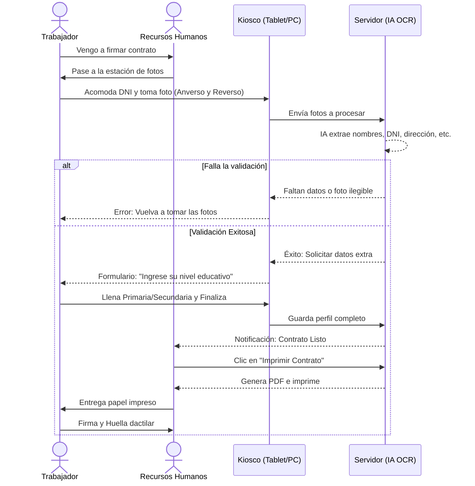

# Flujo Operativo - Sistema Automatizado de Contratos con OCR

Este documento detalla el flujo de usuario y la arquitectura operativa del sistema de captura de datos de DNI y autollenado de contratos, diseñado para minimizar la carga de trabajo del personal de Recursos Humanos (RH) y ofrecer una experiencia fluida al usuario final.

## 1. El Entorno Físico (Ambiente Controlado)

Para garantizar la precisión de la lectura de la Inteligencia Artificial y eliminar el "factor humano" de tomar malas fotos, el sistema depende de una **estación de captura estandarizada** (Zona de Fotos o Kiosco).

- **Mesa de Captura**: Superficie con marcas visibles (cintas rojas o recuadros pintados) que indican **exactamente** dónde colocar el DNI. Al saber si es electrónico, azul o amarillo, el usuario sabe dónde ponerlo.
- **Iluminación**: Luz blanca, fija y difusa enfocada hacia la zona del DNI para evitar sombras del propio usuario o reflejos.
- **Cámara Fija**: Una cámara web de buena resolución (o la cámara trasera de una tablet fija en un atril) fijada a una altura y distancia milimétricamente exactas.
- **Pantalla del Kiosco**: Un monitor táctil (o tablet) orientado hacia el trabajador, con una interfaz con botones gigantes y textos claros.

## 2. Flujo Paso a Paso

### Paso 1: Recepción
El futuro trabajador llega a la oficina de Recursos Humanos indicando que viene a firmar su contrato. 
El personal de RH no "tipea" ningún dato inicial en su computadora; simplemente le indica al trabajador: *"Por favor, diríjase a la estación de fotos de la derecha y siga las instrucciones en la pantalla"*.

### Paso 2: Captura de Imágenes (Acción del Usuario)
En la pantalla del Kiosco, el sistema es 100% autoservicio:
1. El usuario coloca la parte frontal de su DNI dentro de las marcas de la mesa y presiona en pantalla **"Tomar Foto Frontal"**.
2. El usuario voltea su DNI y presiona **"Tomar Foto Trasera"**.
3. El Kiosco envía ambas fotos al sistema interno.

### Paso 3: Validación y OCR Inteligente (Acción del Sistema)
El servidor procesa las imágenes usando nuestro modelo de Inteligencia Artificial:
- Busca la información crítica (Nombres, Apellidos, DNI, Fecha Nacimiento, Sexo, Ubigeo, Dirección).
- **Flujo de Error (Rechazo)**: Si la foto salió borrosa, el DNI estaba fuera de las marcas, o faltó información, el sistema detiene el proceso. La pantalla del Kiosco le dice al usuario: *"Oye, hubo un problema leyendo tu DNI (foto borrosa o incompleta). Por favor, acomódalo en las cintas y vuelve a intentarlo"*.
- **Flujo de Éxito**: Si el modelo detectó todo correctamente, el sistema lanza un mensaje positivo: *"¡Todo correcto! Pasaremos a la digitación de tus estudios."*

### Paso 4: Digitación de Datos Adicionales (Acción del Usuario)
Hay datos requeridos legalmente en el contrato que **no existen en el DNI** (Nivel Educativo).
- La pantalla muestra un pequeño formulario preguntando por sus estudios.
- El usuario selecciona sus opciones (ej. *Primaria Completa*, *Secundaria Incompleta*).
- El usuario presiona **"Finalizar y Enviar"**.

### Paso 5: Confirmación e Impresión (Acción de Recursos Humanos)
1. En la computadora de escritorio de la persona de RH (en su propia pantalla), aparece una alerta en tiempo real: *"Nuevo contrato listo para imprimir: [Nombre del Usuario]"*.
2. RH hace clic en el nombre. Revisa rápidamente en 1 segundo que los datos estén ahí.
3. Presiona el botón **"Imprimir Contrato"**.
4. El sistema fusiona automáticamente los datos extraídos del DNI y los estudios ingresados por el usuario en la plantilla oficial del contrato y manda la orden directa a la impresora.

### Paso 6: Firma Final
El contrato sale impreso. El personal de RH se lo entrega al trabajador, quien lo lee, firma y coloca su huella dactilar física.

---

## 3. Diagrama de Flujo Lógico

